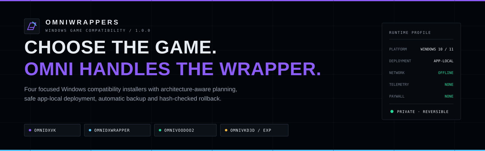

  

<h1 align="center">OmniWrappers</h1>

<b>Choose the game. Omni handles the wrapper — four focused Windows compatibility installers with architecture-aware planning, safe app-local deployment, automatic backup, and hash-checked rollback.</b>

  
  &nbsp;
  

  
  
  
  
  

<!-- Quick navigation. These chips jump to sections on this page or to the
     document they name. Keep each target synchronized if a heading changes. -->

  
  
  
  
  
  
  
  
  
  
  
  

> [!IMPORTANT]
> This public repository contains documentation, graphics, and real UI
> screenshots only. It contains **no installer, executable, DLL, runtime
> payload, source code, or download release**.

## The family at a glance

| Product | Best fit | Current runtime basis |
|---|---|---|
| **OmniDXVK** | Direct3D 8–11 games through Vulkan | DXVK 3.0.2 Omni · x86/x64 |
| **OmniDxWrapper** | Older 32-bit Windows games and legacy APIs | dxwrapper 1.7.8531.25 Omni · x86 |
| **OmniVoodoo2** | DirectDraw, early Direct3D, and 3Dfx Glide games | User-supplied official dgVoodoo2 2.87.3 package |
| **OmniVKD3D** | Experimental Direct3D 12 through Vulkan | vkd3d-proton 3.0.1 + OmniDXVK DXGI 3.0.2 · x86/x64 |

Compatibility always depends on the exact game, patch, GPU driver, mods, and
other injected software. A supported API is not a promise that every title will
work. OmniVKD3D is explicitly experimental on native Windows.

## A safer three-step flow

1. **Target** — select the real game executable, not its launcher or shortcut.
2. **Compatibility** — review detected architecture, imported API, exact DLL
   names, required companions, warnings, and collisions.
3. **Deploy** — install the reviewed plan beside the game with backup enabled;
   roll back only the files matching the recorded installation.

## Consumer-first by design

- Automatic PE architecture inspection and graphics-import analysis.
- Exact proxy-DLL mapping with required companion expansion.
- Preview-before-write, protected-game warnings, and collision review.
- Per-game backup, bounded manifests, and hash-checked rollback.
- Five live UI languages: English, German, Spanish, French, and Romanian.
- Offline operation with no account, ads, telemetry, or background service.
- Privacy-redacted support packages and a controlled test-launch path.
- Precision Hybrid UI: flat graphite surfaces, compact technical labels,
  high-contrast states, and subtle preference-aware motion.

Engineering labs, benchmark panels, Wave centers, corpus tools, and maintainer
commands are deliberately excluded from the consumer interface.

## The actual installer experience

Every image below is a real capture of the current 1.0.0 installer candidate.

| OmniDXVK | OmniDxWrapper |
|---|---|
|  |  |

| OmniVoodoo2 | OmniVKD3D Experimental |
|---|---|
|  |  |

## Donationware, without a paywall

OmniWrappers is free donationware: **no required payment and no ads**. If the
project saves you time or helps an older game run, optional support helps fund
testing, packaging, documentation, and support.

  
  

Third-party runtimes keep their own licenses and rights. A donation does not
turn DXVK, dxwrapper, vkd3d-proton, or dgVoodoo2 into proprietary OmniWrappers
software. See [Legal & licenses](LEGAL.md), [Third-party notices](THIRD-PARTY-NOTICES.md),
and [Source availability](SOURCE-AVAILABILITY.md).

## Release status

Version **1.0.0** is a tested final candidate. The consumer-surface,
installation-flow, and documentation gates pass, but the delivery executables
are not yet Authenticode-signed. This repository is therefore a product
showcase and documentation home—not a public binary distribution channel.

- Consumer surface gate: **17/17 passed**
- Smart installation flow: **11/11 passed**
- Documentation maintenance gate: **4/4 passed**

Read the [release notes](RELEASE-NOTES.md) and [security policy](SECURITY.md) for
the current limits. For help, open an issue using the provided template or
email `omnivex@theomnigrid.biz`.

---

**OmniWrappers · offline · private · reversible**

[TheOmniGrid on GitHub](https://github.com/TheOmniGrid) ·
[Ko-fi](https://ko-fi.com/theomnigrid) ·
[Patreon](https://www.patreon.com/TheOmniGrid)

Tuned for framerate, mixed for headroom, sharp to the pixel. Donationware tools for gamers and audiophiles — audio, graphics, and a bit of privacy too.

